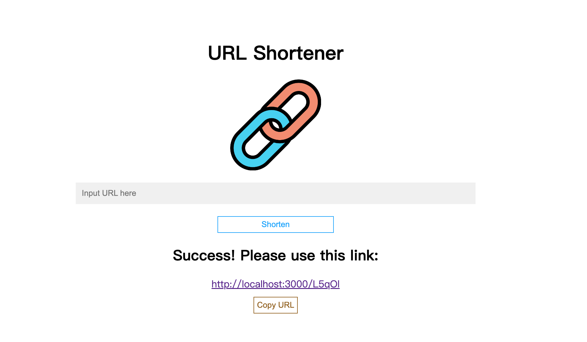

# URL Shortener



## Introduction

An URL shortener built by Node.js, Express and MongoDB

## Features

* Simply input your URL and get a shorter one  
* Shortened link will redirect you to original website
* Click the copy button to copy shortened link

## Environment Setup
Please install Node.js and npm before starting; make sure you already have a MongoDB account

## How to Use

1. Clone the project to local side
2. Access the project directory through terminal, then type in:

   ```bash
   npm install
   ```

3. Once installed, set environment variable to get access to your MongoDB

   ```bash
   MONGODB_URI="Your MongoDB Account Connection String"
   ```

4. Then type in:

   ```bash
   npm run start
   ```

5. You'll see below message in console. Now open your browser and enter URL to use the shortener

   ```bash
   Express is listening on http://localhost:3000
   ```

6. To stop the server:

   ```bash
   ctrl + c
   ```


